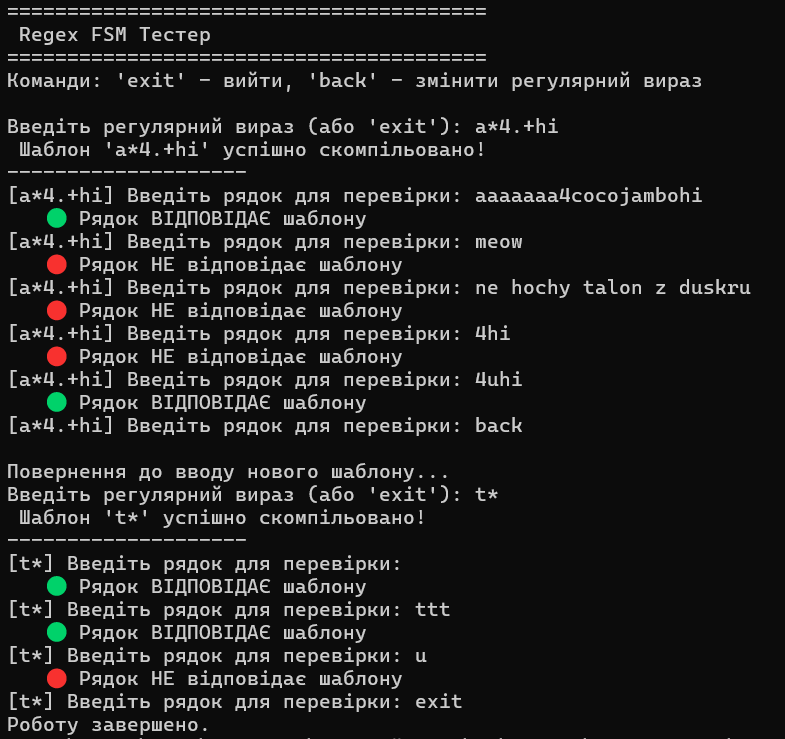

# Лабораторна робота: Регулярні вирази через Скінченний Автомат

Цей репозиторій містить імплементацію спрощеного рушія регулярних виразів на основі недетермінованого скінченного автомата.

## Опис завдання

**Підтримуваний функціонал (базовий regex):**
* Розпізнавання англійських літер (верхній та нижній регістр).
* Розпізнавання цифр.
* Оператор `.` (крапка) — відповідає будь-якому єдиному символу.
* Оператор `*` (зірочка) — відповідає нулю або більшій кількості попередніх елементів.
* Оператор `+` (плюс) — відповідає одному або більшій кількості попередніх елементів.

## Пояснення імплементації

Архітектура побудована навколо базового абстрактного класу `State`. Кожен токен регулярного виразу перетворюється на відповідний об'єкт-стан.

### Основні компоненти:
1. **Базові стани:**
   * `AsciiState` зберігає конкретний символ і порівнює його зі входом.
   * `DotState` завжди повертає `True` для будь-якого символу.
   * `StartState` та `TerminationState` маркують початок та кінець графу.
2. **Квантори (`StarState`, `PlusState`):**
   Реалізовані як обгортки. Вони приймають попередній стан і змінюють логіку переходів, дозволяючи зациклення або пропуск стану.
3. **Компіляція (`__init__`):**
   Програма читає шаблон зліва направо і будує лінійний ланцюжок станів. Якщо зустрічається квантор (`*` або `+`), він "поглинає" попередній стан і замінює його в ланцюжку.
4. **Алгоритм перевірки (`check_string`):**
   Для коректної обробки жадібних кванторів та випадків, коли потрібно відкотитися назад, замість звичайного циклу використано **алгоритм пошуку в глибину (DFS)**. Це забезпечує механізм **бектрекінгу**: якщо певний шлях заходить у глухий кут, автомат повертається і пробує інший (наприклад, "пропустити" `StarState` замість того, щоб споживати ще один символ).

## Інструкція до запуску

Для запуску проєкту не потрібні зовнішні бібліотеки. Використовується стандартне середовище Python 3.

1. Склонуйте репозиторій на свій комп'ютер.
2. Відкрийте термінал у папці з проєктом.
3. Запустіть головний файл (`main.py`):
   ```bash
   python main.py
4. Дотримуйтесь інструкцій інтерактивного консольного меню: спочатку введіть регулярний вираз, а потім — рядки для його перевірки.

## Приклад використання


